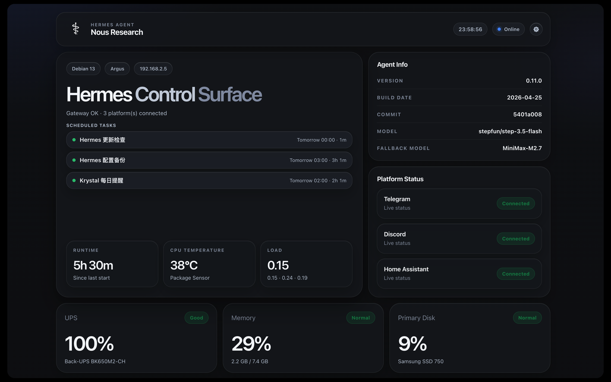
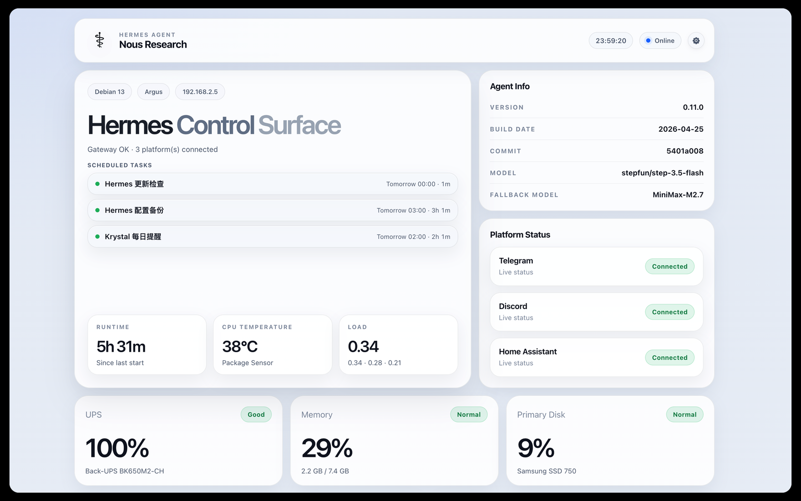
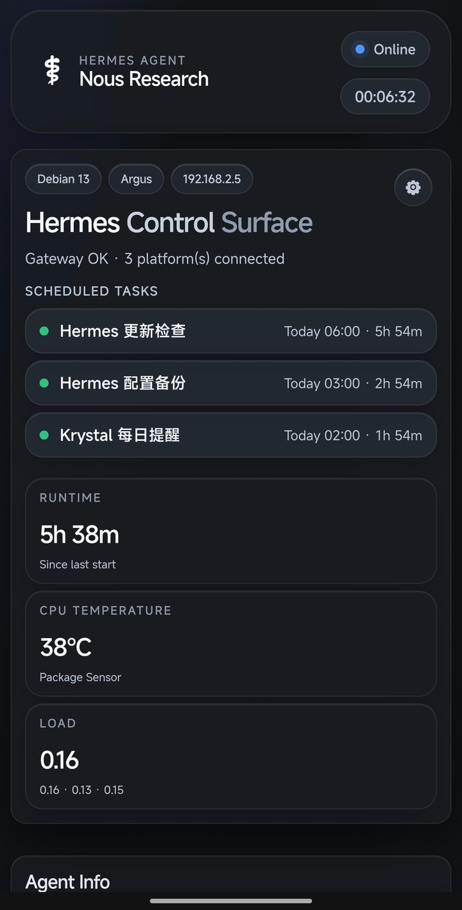
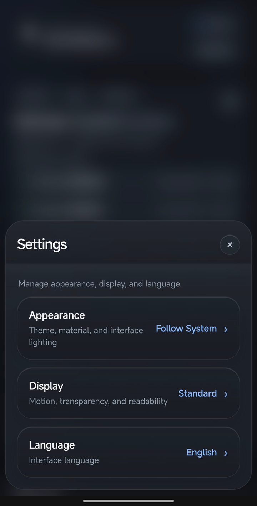

# Hermes Control Surface

[English](./README.md) | [简体中文](./README.zh-CN.md)

A quiet local dashboard for Hermes Agent.

Hermes Control Surface was not originally planned as an open-source project.  
I first built it for my own machine, based on my real local setup: Hermes Agent, system services, network status, storage, UPS, audio, and a few things I wanted to see every day.

After several rounds of cleanup and refinement, I decided to share it.

It is not trying to be a full monitoring platform.  
It is a small control surface for people who run a similar local environment and want one more simple, good-looking option.

There is still room to improve, and more ideas can be added later.  
For now, the goal is simple: keep the important local status visible, calm, and easy to understand.


## Highlights

- English and Simplified Chinese interface
- Browser-language based routing
- YAML configuration with hot reload
- Capability controls for sections, cards, platforms, and service rows
- Responsive desktop and mobile layout
- Optional UPS, audio, network, and service status integrations
- Runs as a small FastAPI service on port `9091`
- No nginx required
- No `.env` file required

## Screenshots

### Desktop





### Mobile

<p>
  
  
</p>

## Design

The interface is inspired by a clean desktop-style control surface: soft glass, quiet spacing, and simple information blocks.

It is also responsive.  
On desktop, it uses a wider dashboard layout.  
On mobile, it switches to a compact header, simpler stacked content, and a bottom-sheet style settings drawer.

The goal is not to show everything.  
The goal is to show the right things clearly.

## Installation

For Debian / Ubuntu installation, see:

- [Installation Guide](docs/INSTALL.en.md)
- [安装说明](docs/INSTALL.zh-CN.md)

Quick install from a local source tree:

```bash
sudo bash scripts/install.sh
```

Manual install is also documented.

## Language

The dashboard supports English and Simplified Chinese.

By default, it follows your browser language.

You can also open a specific language directly:

```text
/?lang=en
/?lang=zh-CN
/?lang=system
```

`system` clears the saved language choice and follows the browser again.

## Configuration

Copy the example config:

```bash
cp config/config.example.yaml config/config.yaml
```

Then edit your local config:

```bash
nano config/config.yaml
```

Most config changes take effect automatically.  
You usually do not need to restart the service after editing `config.yaml`.

If the YAML is invalid, the dashboard keeps using the last known good config.

Your real `config/config.yaml` belongs only to your local machine.  
Do not publish it.

## Showing and hiding things

You can hide things you do not use and keep the page clean.

```yaml
dashboard:
  sections:
    audio: hide

  cards:
    ups: auto

  platforms:
    discord: hide

  services:
    crowdsec: hide
```

Supported values:

```text
auto  use the default behavior
show  always show it
hide  hide it
```

## Services

Services are not scanned automatically.

You choose which services should be checked:

```yaml
services:
  hermes: hermes-gateway
  docker: docker
  crowdsec: crowdsec
```

Then you choose which ones appear on the page:

```yaml
dashboard:
  services:
    docker: show
    crowdsec: hide
```

This keeps the dashboard predictable.

## Documentation

- [Installation Guide](docs/INSTALL.en.md)
- [安装说明](docs/INSTALL.zh-CN.md)
- [Usage Guide](docs/USAGE.en.md)
- [使用说明](docs/USAGE.zh-CN.md)
- [Configuration Reference](docs/CONFIG_REFERENCE.en.md)
- [配置字段参考](docs/CONFIG_REFERENCE.zh-CN.md)

For read-only support diagnostics, run:

```bash
bash scripts/doctor.sh
```

## Notes

Hermes Control Surface is an independent local dashboard.  
It is not an official Hermes Agent release.

This is an early `v0.1.3` release with dynamic rows, diagnostics, safer public defaults, and a disk-display hotfix. Thoughtful fixes, careful polish, and practical ideas are welcome.

## License

MIT
