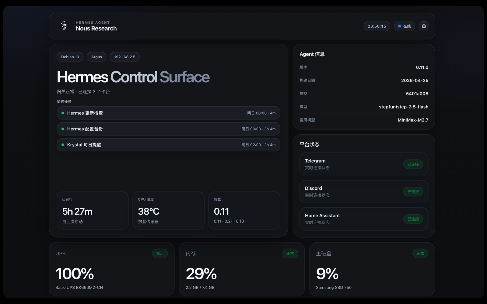
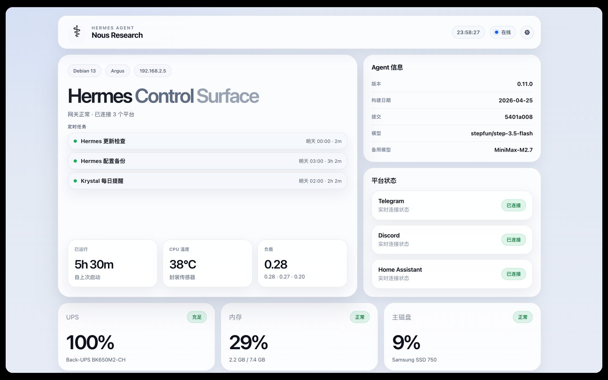
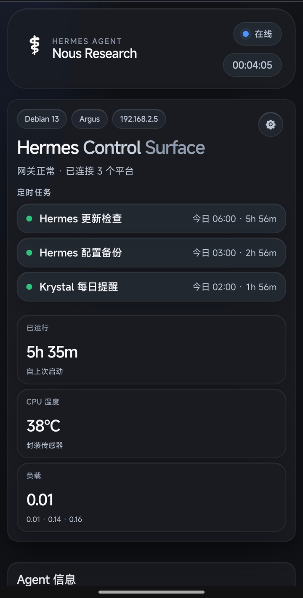
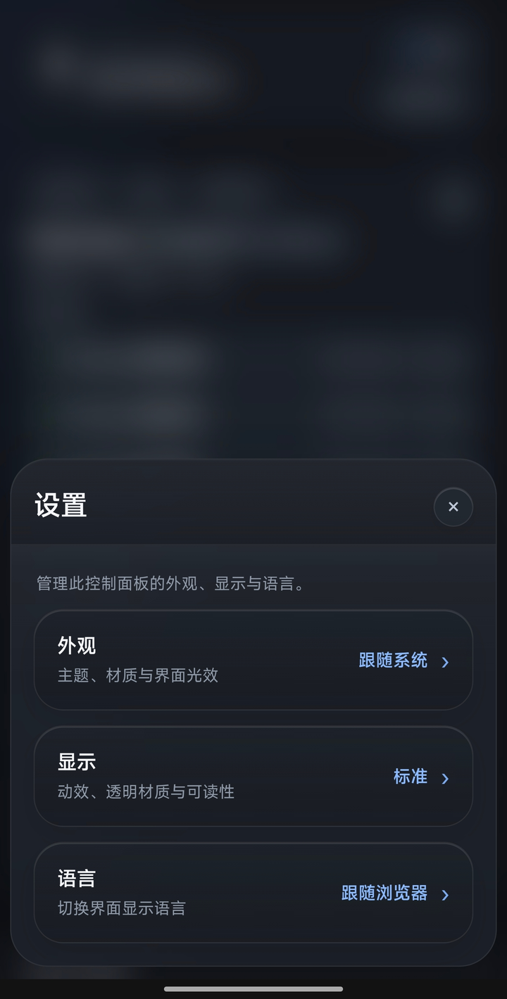

# Hermes Control Surface

[English](./README.md) | [简体中文](./README.zh-CN.md)

一个安静、干净的 Hermes Agent 本地控制面板。

这个项目一开始并没有打算开源。  
最初只是我根据自己真实运行的机器做的一个监控面板：Hermes Agent、系统服务、网络状态、存储、UPS、音频，还有一些我每天确实会看的信息。

后来经过几轮整理、修正和打磨，我决定把它开源出来。

它不是一个庞大的监控平台。  
它更像是一个小型本地控制台，适合那些和我有类似环境、也想多一个简单好看选择的人。

它还在完善中，后面也可以继续引入更多可能性。  
但目前这个基础已经足够清楚：把本地机器重要的状态放在一个安静、好理解的页面里。



## 亮点

- 支持英文和简体中文
- 默认跟随浏览器语言
- YAML 配置自动热加载
- 可控制区块、卡片、平台行和服务行的显示
- 同时适配桌面和手机
- 可选显示 UPS、音频、网络和系统服务状态
- 以轻量 FastAPI 服务运行，默认端口 `9091`
- 不需要 nginx
- 不需要 `.env` 文件

## 截图

### 桌面端




### 手机端

<p>
  
  
</p>

## 设计

界面方向是偏桌面控制台的感觉：柔和玻璃、清楚留白、信息块简单直接。

它也做了手机适配。  
桌面端是更完整的大屏面板。  
手机端会切换为紧凑头部、纵向内容和底部抽屉式设置面板。

目标不是把所有东西都堆出来。  
目标是把真正有用的信息，用舒服的方式放在一个页面里。

## 安装

Debian / Ubuntu 安装说明看这里：

- [中文安装说明](docs/INSTALL.zh-CN.md)
- [English Installation Guide](docs/INSTALL.en.md)

如果已经在项目源码目录里，可以使用安装脚本：

```bash
sudo bash scripts/install.sh
```

也可以按文档手动安装。

## 语言

面板支持英文和简体中文。

默认会跟随浏览器语言。

也可以直接打开指定语言：

```text
/?lang=en
/?lang=zh-CN
/?lang=system
```

`system` 会清除手动选择，重新跟随浏览器语言。

## 配置

先复制示例配置：

```bash
cp config/config.example.yaml config/config.yaml
```

然后编辑本地配置：

```bash
nano config/config.yaml
```

大多数配置修改会自动生效。  
通常不需要因为修改 `config.yaml` 而重启服务。

如果 YAML 写错，面板会继续使用上一次可用配置，不会直接崩掉。

真实的 `config/config.yaml` 只属于你的本地机器。  
不要把它提交到公开仓库。

## 显示和隐藏

不需要的内容可以隐藏，让页面保持干净。

```yaml
dashboard:
  sections:
    audio: hide

  cards:
    ups: auto

  platforms:
    discord: hide

  services:
    crowdsec: hide
```

支持三个值：

```text
auto  使用默认行为
show  总是显示
hide  隐藏
```

## 服务检测

服务不是自动扫描的。

你先指定要检测哪些服务：

```yaml
services:
  hermes: hermes-gateway
  docker: docker
  crowdsec: crowdsec
```

再决定页面上显示哪些服务：

```yaml
dashboard:
  services:
    docker: show
    crowdsec: hide
```

这样页面更可控，也不会意外扫描一堆系统服务。

## 文档

- [中文安装说明](docs/INSTALL.zh-CN.md)
- [English Installation Guide](docs/INSTALL.en.md)
- [中文使用说明](docs/USAGE.zh-CN.md)
- [Usage Guide](docs/USAGE.en.md)

## 说明

Hermes Control Surface 是一个独立的本地控制面板。  
它不是 Hermes Agent 的官方发布。

这是早期的 `v0.1.0` 版本。欢迎认真、克制、实用的修正和想法，一起把它继续打磨得更好。

## 许可证

MIT
